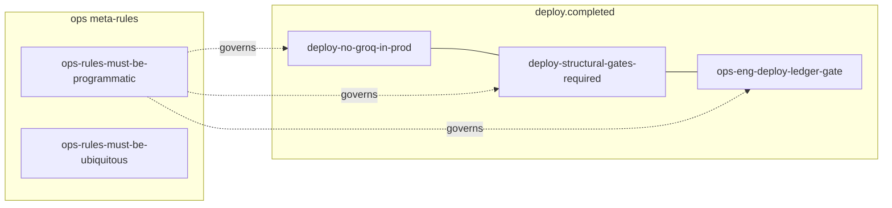

# Optimize Rules — Company Rule Ledger

Use this skill whenever Nick says:
- "optimize rules"
- "cross-reference rules"
- "link the rules together"
- "find rule dependencies"
- "make the rules aware of each other"
- "which rules relate to each other"

This is **not** for adding new rules → use `add-rule` skill.
This is **not** for modifying a single rule → use `update-rule` skill.
This is **not** for strategic gap analysis → use `improve-rules` skill.

## Core Purpose

Rules currently exist in isolation. When `deploy-no-groq-in-prod` fires, the agent has no built-in awareness of `deploy-structural-gates-required` or `ops-eng-deploy-ledger-gate` — even though all three are active at the same deploy event.

This skill:
1. Scans every rule in the ledger
2. Detects natural relationships (shared triggers, shared domain, meta-rule applicability, remediation pairs)
3. Maps those relationships into a visual cluster diagram
4. **Asks for approval before writing anything**
5. After approval, updates each rule's description to include explicit cross-references
6. Distributes the updates so every agent environment sees them

The result: when any rule fires, agents can see the full cluster and act with full context — not just the rule in isolation.

---

## Relationship Types

### 1. Meta-rules (rules that govern all rules)
Rules that apply to *how other rules are created, modified, or enforced*. Every rule in the ledger is a "child" of these.

Current meta-rules to always reference:
- `ops-rules-must-be-programmatic`
- `ops-rules-must-be-ubiquitous`
- `ops-rule-creation-must-distribute` (if it exists)

Every non-meta rule should carry a reference to whichever of these apply.

### 2. Co-trigger rules (same `trigger_name`)
Rules sharing a trigger fire simultaneously. They must know about each other.

Example cluster (trigger: `deploy.completed`):
- `deploy-no-groq-in-prod`
- `deploy-structural-gates-required`
- `ops-eng-deploy-ledger-gate`

### 3. Domain chain rules (same domain, sequential enforcement)
Rules in the same domain that form a logical sequence. When one fires, the next in chain is likely also relevant.

Example (`ops` domain chain):
- `ops-nick-not-a-bottleneck` → `ops-autonomous-improvement-execute` → `ops-eng-work-requires-ledger-item`

### 4. Remediation pairs (detect + fix)
A rule that detects a violation paired with a rule that defines the remediation or follow-on monitor.

Example:
- `email-validate-before-send` (detect) ↔ `email-bounce-rate-check` (monitor/remediate)

---

## Relationship Strength Scoring

| Score | Criteria |
|---|---|
| **Strong** | Same trigger_name + same domain + description keyword overlap |
| **Medium** | Same trigger_name OR (same domain + description keyword overlap) |
| **Weak** | Same domain only OR meta-rule relationship |

- **Strong + Medium links** → written into rule descriptions after approval
- **Weak links** → surfaced in report for human review only, never auto-applied

---

## Workflow

### Step 0 — Rule Zero Check (MANDATORY)
Before doing anything, confirm a work ledger entry exists.
If not, create: `AUTO-{YYYYMMDD}-optimize-rules`

### Step 1 — Fetch All Rules

Pull the full rule set from Supabase via MCP:
```sql
-- Use supabase-mcp-server execute_sql with project_id: cjgsgowvbynyoceuaona
SELECT rule_key, name, description, domain, trigger_name, severity, autonomy_level, conditions_json
FROM rule_ledger.rules
WHERE enabled = true
ORDER BY domain, trigger_name, priority;
```

Also check if a `related_rules` column exists:
```sql
SELECT column_name FROM information_schema.columns
WHERE table_schema = 'rule_ledger' AND table_name = 'rules' AND column_name = 'related_rules';
```

If `related_rules` column exists → use it (JSON array of rule_keys).
If not → append cross-references to the `description` field in the format:
```
[Related: rule-key-1, rule-key-2]
```

### Step 2 — Build the Relationship Map

For every rule, systematically check all four relationship types:

**Meta-rule relationships:**
- Tag every non-meta rule as governed by `ops-rules-must-be-programmatic` and `ops-rules-must-be-ubiquitous`

**Co-trigger clusters:**
- Group rules by `trigger_name`
- For any group with 2+ rules → all members link to each other

**Domain chains:**
- Group rules by `domain`
- Within each domain, sort by `priority` then look for description/condition narrative overlap
- Chains = rules that logically sequence (one must complete before the next fires)

**Remediation pairs:**
- Scan `description` fields for paired language: detect/validate + monitor/remediate
- Flag pairs where one rule surfaces a failure and another provides the corrective action

### Step 3 — Score and Classify Links

For each proposed link, assign strength (Strong / Medium / Weak) using the scoring table above.

Output a complete link table before doing anything else.

### Step 4 — Generate Cluster Diagram (Mermaid)

Produce a Mermaid diagram of the rule clusters. Group by `trigger_name`. Show relationship edges.

Example structure:


### Step 5 — Present to Nick (GATE — DO NOT SKIP)

Output:

**A. Rule Cluster Map** — Mermaid diagram of all clusters

**B. Proposed Link Table** — datatable format:
```
| Source Rule Key | Links To | Relationship Type | Strength | Action |
```

**C. Gaps Found** — Rules with no cross-references and no obvious cluster (may be orphaned)

**D. Confirmation prompt:**
> "Ready to apply {N} Strong and {M} Medium links across {X} rules. Approve?"

**DO NOT proceed to Step 6 until Nick approves.**

### Step 6 — Apply Cross-References

For each approved Strong/Medium link, update the rule description.

**If using `description` field:**
```sql
-- Use supabase-mcp-server execute_sql with project_id: cjgsgowvbynyoceuaona
UPDATE rule_ledger.rules
SET description = description || ' [Related: rule-key-1, rule-key-2]',
    updated_at = NOW()
WHERE rule_key = 'TARGET_KEY';
```

**If using `related_rules` JSON column:**
```sql
UPDATE rule_ledger.rules
SET related_rules = '["rule-key-1", "rule-key-2"]',
    updated_at = NOW()
WHERE rule_key = 'TARGET_KEY';
```

**Idempotency check:** Before appending, verify the cross-reference isn't already present to avoid duplicate entries on repeated runs.

Batch all updates. Log each one.

### Step 7 — Verify

After all updates, spot-check at least 5 rules (pick the ones with most links):
```sql
SELECT rule_key, description FROM rule_ledger.rules
WHERE rule_key IN ('KEY1', 'KEY2', 'KEY3', 'KEY4', 'KEY5');
```

Confirm cross-references appear. Fail loudly if any are missing.

### Step 8 — MANDATORY: Distribute

Run distribution after any rule changes. No exceptions.

```bash
cd ~/scceo-1/grok-personal && python3 distribute_rules.py
```

This pushes updated rules to:
- `AGENT-RULES.md` in all 5 repos (rocket, app, spark-kanban, rv, scceo)
- `AGENTS.md` in scceo-1
- `~/.gemini/GEMINI.md` (global Antigravity instructions)
- `CLAUDE.md` and `.cursorrules` in all 5 repos

### Step 9 — MANDATORY: Verify Distribution

Before saying this run is done:
1. Confirm `distribute_rules.py` completed without errors
2. Spot-check at least 2 repo AGENT-RULES.md files to confirm they contain updated descriptions

### Step 10 — Output Summary

Produce a final summary:

```
OPTIMIZE RULES — [DATE/TIME]

Rules scanned: {N}
Relationships found: {X} strong, {Y} medium, {Z} weak
Rules updated: {N}
Distribution: complete / failed

Clusters created:
- {trigger_name}: {rule_key_1}, {rule_key_2}, {rule_key_3}
- ...

Orphaned rules (no cluster): {rule_key_x}, {rule_key_y}

Next run recommended: after next batch of rule additions
```

---

## When to Run This Skill

- After any batch of 3+ new rules are added
- As part of or after an `improve-rules` session
- When agents consistently miss related rules during enforcement
- When Nick says enforcement feels disjointed or incomplete
- On a cadence after major architectural or product changes (monthly is reasonable)

## What This Skill Does NOT Do

- Does not add new rules (use `add-rule`)
- Does not remove or disable rules
- Does not change `severity`, `autonomy_level`, `conditions_json`, or `action_config_json`
- Does not modify the trigger system
- Does not promote rules to higher autonomy levels

---

## Acceptance Criteria (Verified Before Calling "Done")

| # | Criterion | Verified by |
|---|---|---|
| 1 | All rules fetched from Supabase successfully | Row count > 0 |
| 2 | Cluster diagram generated and shown to Nick | Mermaid output present |
| 3 | No writes executed before Nick approves | Workflow gate confirmed |
| 4 | All approved links written to Supabase | `SELECT` verification per rule |
| 5 | No duplicate cross-references introduced | Idempotency check per rule |
| 6 | `distribute_rules.py` exits 0 | Exit code check |
| 7 | 2+ repo AGENT-RULES.md files spot-checked | File content verified |

---

## MANDATORY: Verify "Done" (Rule: ops-done-means-verified-everywhere)

Before saying this optimization run is complete:
1. Cross-references exist in Supabase with updated `updated_at`
2. `distribute_rules.py` completed without errors
3. At least 2 repo AGENT-RULES.md files contain updated rule descriptions
4. Summary output produced

**If you can't verify all four, do NOT say "done."**
